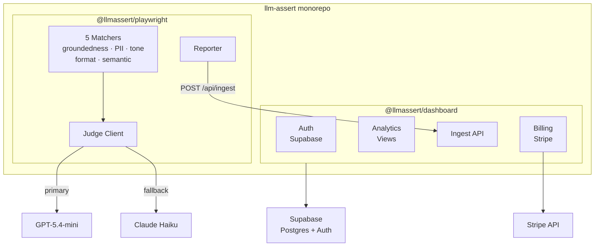

# LLMAssert

[](https://www.npmjs.com/package/@llmassert/playwright)
[](#license)
[](https://github.com/llm-assert/llm-assert/actions/workflows/ci.yml)
[](https://www.typescriptlang.org)
[](https://nodejs.org)

LLM-as-judge assertion matchers for [Playwright](https://playwright.dev). Test your AI outputs for hallucinations, PII leaks, tone, format compliance, and semantic accuracy — then track results over time in an analytics dashboard.

```ts
import { test, expect } from "@llmassert/playwright";

test("response is grounded in docs", async () => {
  const response = "Our return window is 30 days from purchase.";
  await expect(response).toBeGroundedIn("Returns accepted within 30 days.");
});
```

> Provider outages never fail your test suite. When judge models are unavailable, evaluations are marked `inconclusive` and the test passes.

See the full matcher API, configuration, and reporter docs in the [`@llmassert/playwright` README](packages/playwright/README.md).

## Table of Contents

- [Built With](#built-with)
- [Architecture](#architecture)
- [Packages](#packages)
- [Getting Started](#getting-started)
- [Project Structure](#project-structure)
- [Contributing](#contributing)
- [License](#license)

## Built With

[](https://nextjs.org)
[](https://playwright.dev)
[](https://supabase.com)
[](https://stripe.com)
[](https://openai.com)
[](https://www.typescriptlang.org)

## Architecture



## Packages

| Package                 | Description                                              | Link                                                  |
| ----------------------- | -------------------------------------------------------- | ----------------------------------------------------- |
| `@llmassert/playwright` | Playwright test matchers + custom reporter (npm package) | [packages/playwright/](packages/playwright/README.md) |
| `@llmassert/dashboard`  | Next.js 16 analytics dashboard for viewing test results  | [apps/dashboard/](apps/dashboard/)                    |

## Getting Started

### Prerequisites

- [Node.js](https://nodejs.org) 24+
- [pnpm](https://pnpm.io/installation) 10+
- [Supabase CLI](https://supabase.com/docs/guides/local-development/cli/getting-started) (for local dashboard development)
- [Stripe CLI](https://docs.stripe.com/stripe-cli) (for local webhook testing)

### Quick Start

```bash
git clone https://github.com/llm-assert/llm-assert.git
cd llm-assert
pnpm install
```

Create a `.env.local` file with your keys:

```
NEXT_PUBLIC_SUPABASE_URL=https://your-project-ref.supabase.co
NEXT_PUBLIC_SUPABASE_PUBLISHABLE_KEY=sbp_...
SUPABASE_SERVICE_ROLE_KEY=sbp_...
STRIPE_SECRET_KEY=sk_test_...
STRIPE_WEBHOOK_SECRET=whsec_...
OPENAI_API_KEY=sk-...
```

Start the development server:

```bash
pnpm dev
```

Open [http://localhost:3000](http://localhost:3000) to view the dashboard.

### Running Tests and Builds

```bash
pnpm test        # Run all test suites
pnpm build       # Build all packages
pnpm lint        # Lint all packages
pnpm typecheck   # Type-check all packages
```

## Project Structure

```
packages/playwright/     # npm: @llmassert/playwright
  src/assertions/        # 5 assertion matchers
  src/judge/             # LLM judge client + provider abstraction
  src/reporter.ts        # Custom Playwright reporter
  src/fixtures.ts        # test.extend fixtures
apps/dashboard/          # Next.js 16 analytics dashboard
  app/(auth)/            # Sign in/up routes
  app/(dashboard)/       # Authenticated dashboard routes
  app/api/               # API routes (ingest, billing, webhooks)
  lib/supabase/          # Server + browser client factories
supabase/migrations/     # Postgres DDL with RLS
e2e-smoke/               # End-to-end smoke tests
```

## Contributing

Found a bug or have a feature request? [Open an issue](https://github.com/llm-assert/llm-assert/issues).

Want to contribute code?

1. Fork the repository
2. Create a feature branch (`git checkout -b feat/my-feature`)
3. Make your changes and ensure `pnpm test && pnpm lint && pnpm typecheck` pass
4. Commit using [conventional commits](https://www.conventionalcommits.org/) (enforced by commitlint)
5. Open a pull request

## License

This repository uses a dual-license structure:

- **[`packages/playwright/`](packages/playwright/LICENSE)** — [MIT License](https://opensource.org/licenses/MIT). The npm package `@llmassert/playwright` is free and open-source.
- **[`apps/dashboard/`](apps/dashboard/LICENSE)** — [Business Source License 1.1](https://mariadb.com/bsl11/). The SaaS dashboard source is available for reading, internal use, and self-hosting, but may not be used to offer a competing hosted service. Converts to MIT on 2030-04-07.

The root [LICENSE](LICENSE) file is MIT for backward compatibility with prior published versions.
